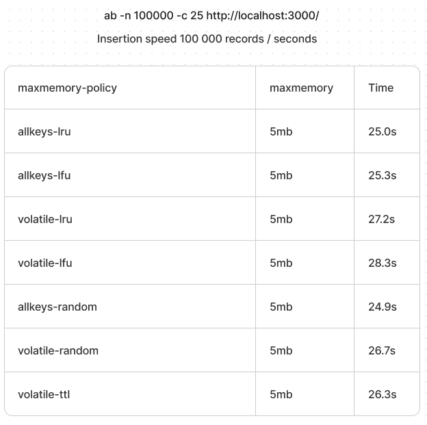
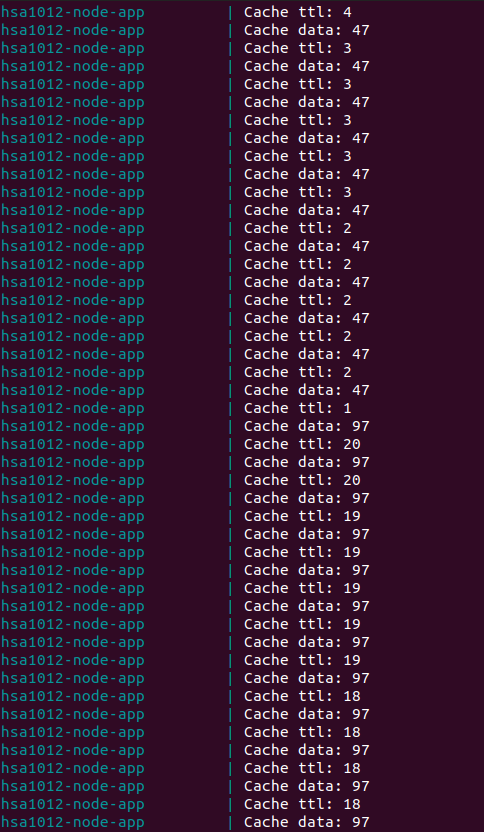

# Redis Probabilistic Cache

To start application run the simple command:

```bash
docker-compose up
```

It will run the applications:

  * [API Server](http://localhost:8083/) on port `8083`
  * [Redis(6 nodes)](http://localhost:6373/) on ports `6373,6374,6375,6376,6377,6378`
  * Redis cluster initialisator(it will kill itself after initializing cluster).

## API Usage

It will set a random key with random walue into redis cluter.

* Open link in a browser [http://localhost:8083/](http://localhost:8083/)
* Make a curl request 
  ```bash
  curl --location --request GET 'http://localhost:8083/'
  ```

## Perfomance with different eviction strategies



## Probabilistic Cache

